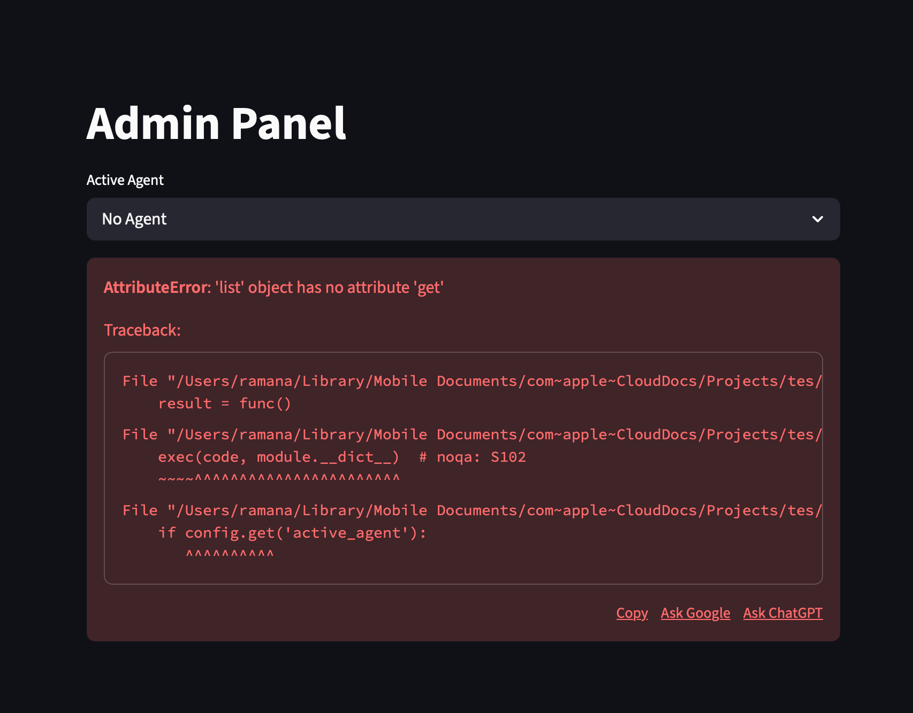
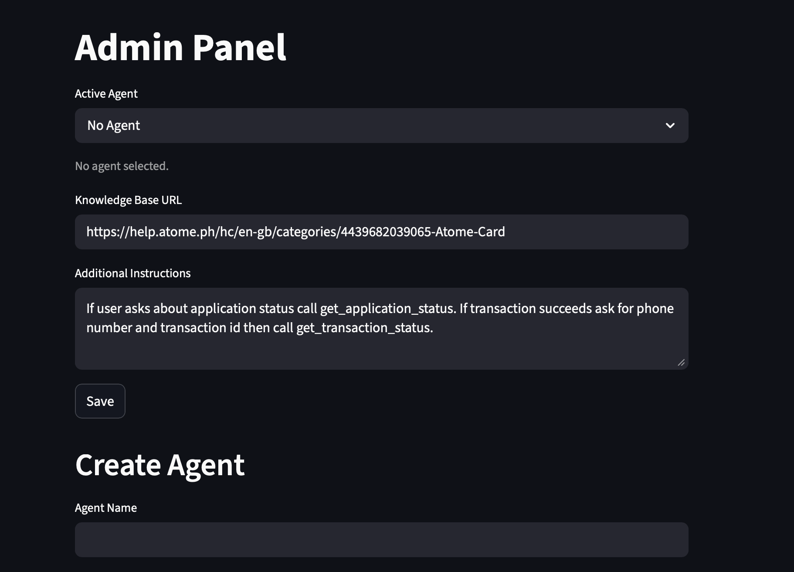
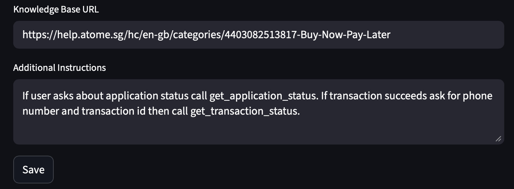
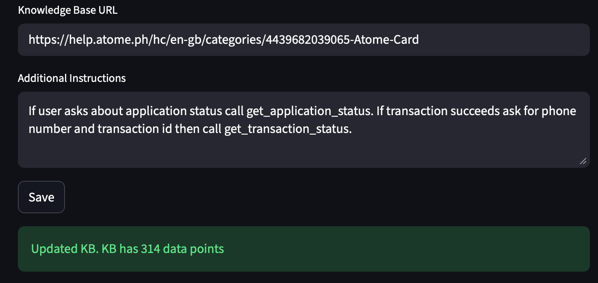

# atome-chatbot

## Brief Overview
1. `chat_ui.py` runs the frontend application for a user to interact with the chatbot.
2. `admin_ui.py` is the frontend application for a user with admin privilleges to configure the chatbot settings.
3. `bot.py` is the backend for the chatbot.

## Pre-reqs and run steps
1. Tested with python 3.13.5. Please ensure version similarity, as backward compatability was not tested.
2. Application was tested on a macOS setup and was not tested against a Windows environment.
3. Ensure you have a personal groq API key.
4. Create a `.env` file in the root folder and place your API key in the file as such: `API_KEY={YOUR_API_KEY}`
5. Run the `run.sh` script with the following command: `bash run.sh`. The script will create a virtual environment and install any required dependencies as specified in the `requirements.txt` file. It will then execute the 3 python scripts `bot.py`, `admin_ui.py`, `chat_ui.py`.
6. The .sh script runs the python programs in the background. To terminate the application use `ps -A` to list all processes and find the PID for the relevant processes (you can `ctrl + f` and search `atome` to find the relevant jobs). Then using the PID you may kill the job with `kill -9 [PID1] [PID2] [PID3]`. In an event the local port 8000 is still being used, by the application you can terminate it by `sudo lsof -t -i tcp:8000 | xargs kill -9`. 

## Known issues and fixes
1. As the `run.sh` script automates running the chatbot application, the frontend python applications (`chat_ui and admin_ui`) may load before the `bot.py` is fully initialized. In this event you may see the following error: 
The fix for this is just to wait a few seconds and refresh the page until the error disappears. Essentially we need to wait for the `bot.py` to be fully initialized. 
2. When entering the knowledge base url or any other inputs in the `admin_ui.py`, it may not capture the entered information and revert to the older value. I.e. in the following images, I had used the .sg url however the application still reverted to the original .ph url that was pre-populated in the field.  The fix for this, is to just re-enter the desired inputs and click on the save button once more. 

## Potential enhancements & Feedback
1. The main aim of this project was to showcase a POC, focusing on the backend elements. Hence streamlit was used for the frontend to speed up prototyping. This has resulted in some of the known issues mentioned above. As always, a full frontend framework could be used with more interactions (chat bubbles, typing indicator etc). Application could also be deployed.
2. There is no ability to delete or edit any agents, this could be a potential enhancement.
3. There is no ability to read from documents, this is a future enhancement.
4. `.json` files were used to simulate data storage, although an actual database connection could also improve the application.
5. Login functionalities for admin and customers would be beneficial to track existing sessions and history. Currently `chat_ui` loses all session history on page refresh, and in general, maybe caching.
6. In the admin page, a dashboard can also be provided with data analytics per agent, to identify instructions that lead to better chatbot performances and allow for greater fine tuning.
7. There can also be better error checks, if config/agent/data exists etc.
8. We could also add a re-ranking layer for the llm to identify better performing models.
9. We also have some rule based instructions which will require code edits if these rules were to change, so potentially a pure LLM function calling could be better.
10. We could also deploy agents randomly and evaluate performances, and this can be potentially handled at the admin side as well.
11. Scraping was also only tested on atome FAQ sites (.sg and .ph), scraping functionality could have been tested against various sites as well to ensure robustness.
12. We could also show source links and confidence scores.
